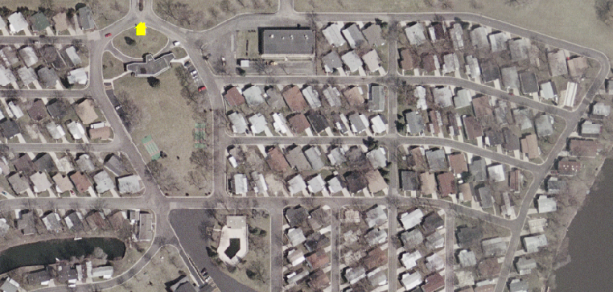

# Residential Land Uses (1100 series)

**Contents**
* TOC
{:toc}
---
Land in predominantly residential use, including surrounding land that
is a part of a residential development. This category excludes housing
on military bases as well as group quarters housing. Group quarters
housing is included within their associated land use as defined below.
Examples: military barracks are included as part of the military base
which is defined as Governmental Administration and Services; nursing
homes are included in Medical and Health Care Facilities; college
dormitories would appear in Educational Facilities.

**The difference between single-family and multi-family:**

-   *Single-Family Residential* includes all single-family housing, as well
    as multi-unit structures (i.e. townhomes and duplexes) whose units do
    not share a common entryway, but rather, each unit has a separate front
    entrance. Residential parcels in established neighborhoods with no
    structures are included, with the RESUNIT count set to zero.

-   *Multi-Family Residential* includes multiple-unit residential buildings
    with a common entryway. Includes retirement complexes (except nursing
    homes), as well as two-flats, three-flats, condominiums and
    cooperatives. Also includes SROs (buildings with single-room occupancy).
    With two-flats and three-flats, while each unit may have a separate
    front entrance, the fact that one unit is on top of another unit puts it
    in the multi-family classification.

**NOTE:** If one parcel should happen to have BOTH single-family AND
multi-family residential units in the SAME parcel, then go with the
concept of coding to the more ACTIVE land use which in this case would
be multi-family Residential.

**AS OF THE 2015 INVENTORY we are attempting to assign residential unit
estimates to every residential parcel, meaning:**

-   1111 - Single-Family, Detached
-   1112 - Single-Family, Attached
-   1130 - Multi-Family
-   1140 - Mobile Home Park
-   1216 - Urban Mix with a Residential Component

As nice as it would be to have residential unit counts for the other
categories, it isn't practical to collect this information at the parcel
level. Some parcels will already have residential units generated by
pre-processing activities--leave those numbers in, but do not try to
collect any additional information.

In the final version, the residential unit counts for Single-Family
Detached and Attached will be used to generate estimates of residential
density (housing units per acre). Density will also be inferred for
other residential areas by the 1130 Multi-Family and 1140 Mobile Home
Park codes.

**Scattered Single-family or small-multi-family residences owned by an
institution:** Be aware that some individual houses or occasionally
townhomes or small multi-family buildings may be owned by a government
entity or a social service organization. When evidence supports that
they are being used as residences, not offices, these should be coded
with the appropriate residential code. Examples include homes owned by
City of Elgin that house police officers and their families as part of
the Resident Officer Program; individual houses scattered throughout
Aurora owned by Aurora Housing Authority as low-income rental property;
small group homes for disabled individuals owned by Association for
Individual Development.

## Single-Family Residential, Detached (1111)

**Definition:** One housing unit per free-standing residential
structure. Can include un-developed Residential properties when adjacent
to a developed property with the same owner. Residential unit estimate
required.

**Discussion:** This is your classic "one home per parcel,"
and is probably the most frequently-occurring use in the region. For
most counties, a large number of properties were pre-coded using an
automated (or query-based) approach; this was possible where we had
access to a residential unit estimate (based on assessor coding) and an
assessed value. The query operates on parcels where:

-   `LU_PASS1 = 'RES'`
-   `RES_UNITS = 1`
-   `PARCELMOD = ''`
-   *County assessed value over a certain threshold (varies per county)*
-   `SHAPE_Area >= 8712` (0.2 acres).

In McHenry County, this procedure accounted for nearly 50% of all of the
parcels. In reality, there is likely some mis-coding of duplex buildings
that sit on a single parcel. This is one of the hazards of automation,
and will hopefully be caught by the diligent coder while working on the
remaining residential parcels.

**Very tiny parcels:** Occasionally in
residential areas, especially those with single-family detached parcels,
you will find a very tiny parcel which has an owner that is completely
different from any adjacent parcel. Possibly the county overlooked this
tiny parcel for a name change when a house was sold to another party.
Unless you have definitive evidence that something else is happening on
this parcel, go ahead and code it the same as the other adjacent parcels
which in **Single-Family Detached** neighborhoods would be **1111**. Be
sure this tiny parcel has a zero in the residential units field. Below
is an example of such a tiny parcel.

**Examples:**

Suburban development, lots approximately 1/4-acre.

**Q&A:**

-   *Q: How do I handle it when a residential property with one owner is
    split over multiple parcels?*
    -   **A:** All of the parcels should receive the 1111 (Res SF
        Detached) code if they are obviously part of a single property
        meaning the parcels are adjacent to one another; however, only
        **one** of the parcels should have a "1" value in the
        Residential Estimate field. All other parcels should have the
        Res Estimate field calculated to zero, if it doesn't already
        hold that value. The "1" should be assigned to the parcel that
        has the higher Improvement Value. If the same homeowner also
        owns a parcel that is nearby, but not adjacent to that owner's
        other parcels such as across the street or down the block, then
        this would be coded **Residential Vacant 4110**. One exception
        to this is if there is virtually nothing, no road or alley,
        between this parcel and the others that are part of the owner's
        residential property, and it is obvious that the parcel in
        question is being used as part of the residential property. In
        this case you can also code it as part of the residential
        property with zero residential units.

-   *Q: What about a single undeveloped parcel within an established
    (neighborhood/subdivision)?*
    -   **A:** If the parcel is of roughly equal size to the surrounding
        parcels and is not owned by someone who owns an adjacent,
        developed property, then that parcel gets coded **4110 Vacant
        Residential Land**. However, if it is a newer subdivision that
        is simply not yet built out, then...
        -   ...if it is farmed in the 2010 aerials, it should be coded
            **Agriculture (2000)**, with PLATTED = "R"
        -   ...if it is simply vacant (trees or grass), code it
            **Vacant (4100)**, with PLATTED = "R"
        -   ...if there is scraped earth or other evidence of constructions,
            code it **4210 Under Construction, Residential**.
    -   **A:** One exception to the above 4110 code is if that
        undeveloped parcel which has a different owner from all the
        surrounding parcels, is land locked, meaning there's no way to
        get to this property unless you cross property owned by someone
        else. In this case, code it with the same residential code as
        the surrounding parcels and make sure there's "0" value in the
        residential units field. Vacant implies it can be built upon
        which is not likely in this case.

-   *Q: How do I code a separate parcel owned by a religous organization
    that primarily has a house on it while the actual religous
    organization building for assembly is on a different parcel?*
    -   **A:** Code this as residential if only the house is on the
        parcel, not the building in which the congregation meets.
        Remember to code the residential units as "1".

-   *Q: What if a house is used by a religious or other non-profit
    organization solely as offices and there is no indication that
    anyone lives in the house?*
    -   **A:** Code the parcel for this house used solely as offices as
        **1215 urban mix**.

-   *Q: Six houses are all on one parcel owned by a mission
    organization. How do I code this?*
    -   **A:** Code this as **111 Single-family detached**. Change the
        number in the residential units field to the number of houses on
        this one parcel which in this example would be "6".

-   *Q: How do I code a parcel with a house on it and owner is a county
    health department?*
    -   **A:** Unless you have information that this house is solely
        used as offices for the organization, assume that it is a
        residence. It is probably a group home run by a county
        organization. Code it **111 Single-family detached residential**
        with residential units of "1".

-   *Q: How do I code a parcel identified as AG by the county that has a
    farm house on it?*
    -   **A:** If the parcel identified by the county as agriculture
        that has a house on it is 1 acre or less (43,560 sq ft) then
        code it **1111 Single-family detached** with "1" in the
        residential units field. If the parcel is larger than that and
        agriculture is the appropriate code, then code it **2000
        Agriculture**. In this case, put nothing in the residential
        units field.

-   *Q: How do I code a relatively small parcel identified by the county
    as AG which is next to a residential parcel with the same owner.
    There's a single family detached house on the residential parcel.
    The AG parcel has nothing on it that in any way would suggest
    agriculture; nothing that looks like it's used for commercial
    agricultural.*
    -   **A:** Code this as **1111 Single family detached** with "0" in
        the residential units field. Below is more about **Rural
        Residential** which is also discussed under Agriculture.

        A house in a rural setting on a large parcel with a private barn and
        horses would be coded **Residential** unless there is evidence that it
        is a commercial equestrian operation. Below are two examples of **Rural
        Residential** which would be coded **Residential** Land Use even though
        the county may classify such land as agriculture or farm. In the first
        photo, this Rural Residence is on 3 parcels. The small one on the far
        right is the house. The other two are coded by the county as farm, but
        there is no evidence of any commercial crop or grazing so this is coded
        **1111 (Single-Family Detached)** with one residential unit in the
        parcel containing the house and zero in the other two parcels, all of
        which have the same owner.

        

        In the second photo, the house is in one parcel and the private horse
        stables are in an adjoining parcel with the same owner. This also will
        be coded as **Residential**.

        

-   *Q: How do I code parcels that are part of a homeowners association
    that has a private air strip?*
    -   **A:** Code the parcels that strictly are part of the actual air
        strip and associated air transport facilities as **1530 Aircraft
        Transportation**. Parcels for the housing will have the
        appropriate residential code as will also be true for any common
        open space which is part of the association.

-   *Q: In residential areas I occasionally have found what first
    appears to be a house owned by a government entity, usually a
    municipality. Upon closer inspection, I find it is a water pumping
    station in a house-like structure I guess to blend better into the
    neighborhood. How do I code this?*
    -   **A:** Yes, you occasionally will find water pumping stations in
        neighborhoods masquerading as small houses! Code this **1564
        Other Utility/Waste**. In other cases, you may find a residence,
        usually a house, with a county government, non-profit social
        service agency, or religious organization owner. These are often
        group homes for agency clients or living quarters for members of
        that religious organization. Code these as you would any other
        residence based on the building structure.

-   *Q: How do I code a parcel that is identified as residential by the
    county and with 1 residential unit on it, but the aerial photo shows
    that the parcel has a small church and parking lot on it and also a
    house on it?*
    -   **A:** Code this for the church and not for the house. Code it
        **1350 Religious** and have 0 in the residential units field.
        Even though there is a house on this parcel, ONLY parcels coded
        as residential will contain a residential unit number in the
        final processing.

-   *Q: How do I code a model home owned by a developer which has not
    been sold yet to a private individual?*
    -   **A:** Code a model home as whatever code is appropriate for that
        house structure, single-family detached or attached (**1111 or
        1112**); put the appropriate number in the residential units field
        as though it had occupants. If an adjacent parcel is being used for
        parking for the model home or is just vacant and also owned by the
        developer, code this **Residential Vacant 4110** because the parking
        will eventually be gone and a residence will most likely be built on
        the adjacent parcel. Because of the 2010 Landuse being used for
        modeling purposes, we must not just look at the specific way a
        particular parcel is being used in spring 2010 but also consider the
        overall purpose of the property.

-   *Q: How would one code a house that also has buildings and fencing
    determined by internet searches to be for dog breeding?*
    -   **A:** Dog breeding does not fit our Landuse definition for
        Agriculture, so even if the county coded it as agriculture, code it
        as *' 1100 Single-family Detached*' with 1 residential unit. If
        there is a Dun & Bradstreet point indicating a business AND you
        could see substantial buildings in addition to a house indicating
        significant business activity AND the county coded it commercial,
        you could consider coding it **1216 Urban Mix With Residential
        Component** with no residential units needed.

-   *Q: How do I code a parcel owned by the State of Illinois that has 2
    houses on it which appear to be occupied and used as homes, not
    offices for state employees. The county use code is Exempt. Zero is
    in the Residential Units field.*
    -   **A:** The count in the Residential Units field is a guess based
        on other information found in the parcel data during
        pre-processing. In this case, the reason for the zero is because
        of the Exempt status by the county. The State of Illinois owns
        some parcels that continue to have active residences because
        they bought that land in anticipation of a future development
        project such as an expressway, a bypass, a new airport, etc. If
        you see evidence that the parcel is being used as residence,
        then even though it is owned by State of Illinois, code it with
        the appropriate Residential code and change the Residential
        Units to the correct number.

## Single-Family Residential, Attached (1112)

**Definition:** Townhomes, duplexes, and other multi-unit structures
whose units do not share a common entryway. Residential unit estimate
required.

**Discussion:** Most (if not all) of the counties do not
distinguish between detached and attached single-family residences. The
planning community recognizes the distinction because of the "density"
implications of attached dwellings. Because we are identifying attached
dwellings apart from detached, a keen eye needs to be kept on the parcel
outlines over the aerial photography to identify areas where parcel
lines slice through buildings.

**Examples:** Below is an example of two
townhome developments that would code to 1112. The property to the right
is easy to spot since the parcel boundaries literally slice up the
building by owner. The property to the left is part of the same
development, but the county's parcel file depicted it differently,
forcing all of the units to get merged together into a single polygon
during the pre-processing steps.

Duplexes. Note that the buildings are of similar size to the
single-family detached to the north-west. Duplexes tend to have a more
symmetrical footprint and, hopefully, have a parcel line running down
through them.

This is a rental property
(entire parcel owned by a management agency), and could almost pass for
multi-family, but it's actually single-family attached, based on the
definition. Note the numerous driveways in front of the building,
suggesting that there is a separate garage (& entryway) for each unit.
Below is the same development, shown in Bing Maps oblique (bird's eye)
imagery:

Below is an example of a 12-unit building in which each unit is a
separate parcel. There are 6 units on each side of the building. These
units as individually partitioned provides enough evidence to treat this
as **1112 Single-Family Attached**. A GoogleMaps Street View provides
more evidence that each of the 12 units is a 2-story townhouse. Also,
each townhouse unit has a separate parcel with the same owner name for
garage parking for that townhouse unit. Be sure to have zero for the
residential units for the separate garage parcels if they are, indeed,
separate parcels. Also be aware, that sometimes each townhouse parcel
and garage parcel is combined into one multi-part polygon.

Below is another example of small parcels for parking that are
separately-owned by the owners of the single-family attached units to
the east and west of the parking. In this case, the spaces are not part
of a garage but simply outdoor parking spaces that are separately owned.
Also code these polygon parcels for parking as **1112 Single Family
Attached**. Be sure there is a ZERO in the residential units for the
separate parking parcels. If these separate parking parcels were owned
by a Homeowners Assocation or by a building management company, they
would then be coded as **1151 Residential Common**.

**Q&A:**

-   *Q: Large senior living communities often have several different
    types of housing as part of their community. How do I handle this?*
    -   **A:** If a nursing home component of housing is in such a
        parcel which also includes independent living houses,
        townhouses, and/or apartments, then code the entire parcel as
        medical. If there is a parcel in the senior community that is
        entirely independent living residences, then code that parcel as
        residential single-family detached, attached, or multifamily
        depending on the type of independent housing in that parcel. If
        the parcel is coded as single-family detached or attached, be
        sure to change the residential units number to show how many
        single-family units are in that one parcel.

-   *Q: How do I code the parcel shown in the photo below. It is a
    senior living community with a majority of townhouses. Dun &
    Bradstreet points show some residences have small home-based
    businesses. In the same parcel, there is also a multi-story building
    which has independent-living and also assisted-living apartments for
    seniors in which residents contract for needed services to assist
    them with daily life. The census data reference layer shows nothing
    in the I\_NURS field so there is no nursing home in this census
    block.*
    -   **A:** Since there is nothing in the I\_NURS census data field
        and your research shows there is not a nursing home, then this
        would NOT be coded 1310. While there is a majority of
        townhouses, the additional presence of the apartment building
        would mean **1131 Multi-Family Residential** would be the most
        appropriate code.

        

## Multi-Family Residential (1130)

**Definition:** Multiple-unit residential buildings with a common
entryway and/or the units are on top of one another. Includes retirement
complexes (except nursing homes), as well as two-flats, three-flats,
condominiums and cooperatives. Includes single-resident occupancy (SRO)
buildings. Not included are mixed-use areas with street-level commercial
with between 1 and 3 floors of residential above; those are coded *1216
Urban Mix w/Residential Component.* High-rise apartment buildings with
street level commercial, however, are coded as multi-family.

**Reference Layers:**
-   Primary:
    -   *Landuse05\_MultiFamily.lyr* in Reference Data folder.
-   Secondary:
    -   *CoStar\_MultiFamily.lyr* in Reference Data folder. This is by
        no means comprehensive, and is based only on prior sales
        records, but it might help identify MF properties missed
        elsewhere.
    -   Census block data for your county, found in the *Census2010*
        geodatabase in the Reference Data folder.

**Discussion:** This category includes apartment buildings (including
the urban two-flats, three-flats, courtyard buildings & high rises),
along with apartment and condominium complexes where the "separate
entrance" required for single-family is not evident. While two- and
three-flat style apartment buildings are listed as RES, many counties
treat apartment *complexes* as commercial properties, reflected by a COM
designation in the PASS1\_USE field. Visually, some of these complexes
can resemble small office complexes, so you may need to use additional
resources to verify that it is indeed an apartment complex. Recommended
sources are Bing Maps "birds eye" view, as well as Census block data (a
high housing unit count) and the 2005 Land Use Inventory 1130
(Multi-family) class.

**Examples:**

Apartment complex in DuPage County.

Chicago: two-flats, three-flats, and courtyard buildings.

Apartment buildings in Aurora...

...and how they look in Bing Bird's Eye (rotated).

**Q&A:**

-   *Q: Many two-flats have two doors at the front, meaning they
    technically have separate entrances. Doesn't this mean they should
    be coded Single-Family Attached?*
    -   **A:** Technically, this may be correct, but from a practical
        standpoint we can't make this distinction because we're not
        going to look at the front of every single building. Another way
        of looking at this is "vertical space"--are the units
        side-by-side (duplexes & townhomes: SF-Attached)? Or are they
        stacked (apartment & condo buildings: MF)? So with a two-flat
        building there may be two separate front entrances but the flats
        are one on top of the other so this will qualify it to be coded
        as 1130 Multi-Family.

-   *Q: The photo below shows a 2-story California-style apartment
    building in which each apartment has a separate front entrance. How
    should this be coded?*

    

    -   **A:** Even though each apartment has a separate entrance, it is
        also a two-story building so units are on top of one another.
        This meets the criteria to code it **1130 Multi-Family**.

-   *Q: How do I code a separate parcel that's owned by a college, but
    is clearly apartments for students? Is it multifamily residential or
    is it higher education institutional?*
    -   **A:** Code this as higher education institutional and make sure
        there is a "0" in the residential units field.

-   *Q: How do I decide if a parcel should be coded 1250 Hotel/Motel or
    1130 Multi-Family Residential? The photo below shows this building
    to have rooms for rent, weekly or monthly only.*

    

    -   **A:** The main reference layer to use will be the Census data.
        Look at how many housing units are in that census block in the
        HU\_TOT field. If the only way to account for that number would
        mean counting each unit in this building as one residential
        housing unit, then that would most likely mean it would be coded
        **1130 Multi-Family Residential**. On the other hand, keep in
        mind that at least one manager’s apartment would occupy this
        building, whether hotel or apartments. Also, look at all the
        other residential buildings in this census block. If the number
        of housing units for this census block is not large enough to be
        able to count each unit that you estimate to be in this building
        as a housing unit, then you probably have reason to code it
        **1250 Hotel/Motel**. Also, see if there’s a DnB (Dun &
        Bradstreet) point for this building saying it is a hotel or use
        other reference layers which may code it as a hotel such as the
        Hotels/Motels reference layer and/or the 2005 Landuse to further
        substantiate your 1250 Hotel/Motel code.

## Mobile Home Parks and Trailer Courts (1140)

**Definition:** Collections of small, manufactured, uniform housing;
includes common areas, office, and associated open space.

**Primary Reference Layers:**
-   2005 Land Use Inventory, polygons coded 1140
-   MobileHomeDotNet\_Geocode.shp in Reference Data folder

**Discussion:** Generally, these sites are on commercial parcels. The
two reference layers cited above should identify most of them, so the
recommended approach is to turn on both of these layers and do your
entire county in one go. The
[MobileHome.net](http://www.mobilehome.net/communities/il/index.htm)
reference layer has not been thoroughly checked out, and may include
some addresses of locations that are not mobile home communities.
Additionally, it may include some communities that, while filled with
manufactured housing, actually belong in the 1111 (single-family,
detached) group. See the second example below.

Also, make sure the site isn't actually a campground, which would code
to 3400, Non-Public Open Space.

**Examples:**

Mobile home court in Aurora.

Manufactured home community: Willow Lake Estates in Elgin. Resembles a
trailer park, but functionally more like single-family. Code 1111.

**Q&A:**

-   *Q: Three parcels coded as residential by the county all have the
    same owner. The largest parcel has 1 house and 4 mobile homes on it;
    the other 2 parcels are driveway for the mobile homes. Google
    StreetView shows 5 mailboxes near the house and driveway to the
    mobile homes. I can see no signage saying this is a mobile home
    park. How do I code this?*
    -   **A:** Even though there is no sign, all the mailboxes near the
        entrance indicate this is a very small mobile home park most
        likely with a caretaker living in the house. You can code this
        as **1140 Mobile Home Park**.

## Residential Common Open Space (1151)

**Definition:** Common open space in a residential development; may be
managed by homeowners’ association (HOA) or owned by the local
municipality.

**Discussion:** These parcels are fairly common in newer
developments, and basically represent the portions of a residential
development that are not given over to private ownership. This may
include park-like green space, detention basins, parking, or buffer
strips along major roadways. In most cases they are easily identified in
the parcel data because the owner is listed as such-and-such Homeowners
Association, or HOA. In some instances, land serving that function is
owned by the local municipality. Provided such land is not an actual
park or preserve (3100 or 3300, using that muncipality's park district
website as a resource if available) and doesn't appear to simply be "on
hold" (waiting for another development to go up there), then this code
can be used. This does NOT include land held by a developer for future
phases of a development. In these cases the property should be coded
4100, platted Residential. Also, if a parcel consists entirely of
roadway within a subdivision, it should be coded 1512: Roadway. In some
lake side areas, you will find HOAs that also join together to form
"water associations" or "waterway associations" for neighborhoods to
support the lake ecosystem. "Water association" land will be treated
similar to HOA land; any parcels totally water would be coded as Water.

**A Query to Identify the Majority of these Properties:** This set of
queries can be used to select the majority of these properties:

1.  Select by Attributes in the landuse layer where `TAXNAME LIKE
    '%HOME%ASSOC%'`
2.  Then select from that set only those records that are uncoded
3.  And select from that group only the residential parcels
4.  And select from that group those with an improvement value of 0

These can be strung together as a single query with a series of AND
statements.

Then, do a **Select by Location** on that set to remove those that might
actually be “roadway” parcels:

-   “Remove from the currently selected features in”
-   Target Layer: Landuse
-   Source Layer: Navteq Streets
-   Selection Method: Target features intersect the Source layer feature

Finally, open the attribute table, sort on TAXNAME, and scan the list to
make sure that they are all legitimate HOA entities. Non-HOA names can
be picked up in the query, such as "FEDERAL HOME MORTGAGE ASSOC" Verify
that there are no parcels with a value in the RES\_UNITS field. In
either case, you can right-click on the record to remove from the
selection set.

**Examples:**

Homeowner association land in a subdivision near Batavia.

Common area surrounding a townhome development (shaded parcels).

**Deciding between 1151 Residential Common or 1565 Stormwater
Management** The retention pond and surrounding land in the photo below
is Exempt by the county and owned by the City of Hickory Hills which are
two criteria that could fit for a **1151** code. However, since it only
has residential bordering on about 50% of the the property, we will rule
out a Residential Common code. If it was all or MOSTLY surrounded by
residential, then it could be coded **1151 Residential Common**. There
is a Hickory Hills Park District which identified only a 4 acre Prairie
View Park on the north side of this retention pond and does own one
parcel on the north side of this pond so Open Space will only be a good
code for that one very small parcel barely visible in this photo on the
north side. All the other city-owned parcels should be coded **1565
Stormwater**.

**Q&A:**

-   *Q: How do I code parcels in a residential development that are
    owned by a HOA and that are much more concrete than green, although
    they could have some green areas? The parcels are not solely a road
    through the development which I know would be coded Roadway. It
    could be mostly parking for an apartment complex. It could be a
    small area for the mailboxes in a neighborhood. It could be a small
    parcel for visitor parking in a townhome development.*
    -   **A:** Go ahead and also code these areas 1151 Common Open
        Space. Make sure there is a "0" in the residential units field.

-   *Q: How do I code a recreation building with tennis courts and/or
    outdoor pool that is in a separate parcel and owned by a homeowners
    association?*
    -   **A:** Since it is owned by a HOA, also code it 1151 Common Open
        Space. If it were owned by a municipality, then check on the
        internet to see if it is a designated park or recreaton center
        in that town. If so, it would be coded **3100 Open Space,
        Recreation**.

-   *Q: How do I code a 9-hole putting green owned by a homeowners
    association and in a separate parcel?*
    -   **A:** Code this as **1151 Common Open Space**. This is because
        it is owned by an HOA. In order to better automate parcel-based
        landuse in the future, we are putting more emphasis than before
        on owner.

-   *Q: Where do we draw the line between Common Open Space in a
    Residential Development (1151) and Open Space, Primarily Recreation
    (3100)? Grande Park is a massive residential development surrounding
    a very large park and school in Plainfield. I’ve coded the school as
    K-12 Educational Facilities, but am wondering what to do about the
    park land. It’s all owned by the local park district; should the
    park be regular recreational open space, or should it be common open
    space since it’s technically within a residential development? What
    about the trail system (also in parcels owned by the park
    district)?*
    -   **A:** The rule of thumb is to follow the parcel owner. Even
        though land is by a housing development, if it’s owned by a park
        district and looks like it could be used for recreation as open
        space then code it 3100 open space recreation. This applies to
        the trail system parcels owned by the park district as well.

-   *Q: What about the common areas of a new development that appear to
    be finished such as retention ponds in place, bushes planted, etc.
    but most of the residential lots do not have houses on them yet?*
    -   **A:** It's ok to code these common areas in a new development
        that are basically finished as **1151 Residential Common**.

---

*Return to [A field guide to Land Use Inventory classifications](./index.md)*
