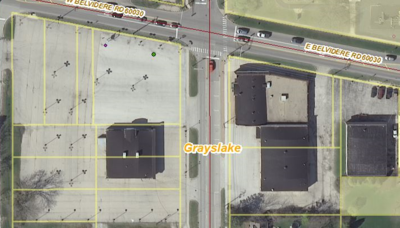
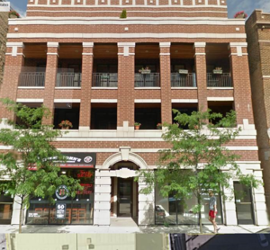

# 1200 Series: Commercial Land Uses
{: .no_toc }

## Table of Contents
{: .no_toc .text-delta }

* TOC
{:toc}
---

Detention/retention basins occupying commercial parcels are coded **1565
Stormwater Management**.

## Primarily Retail/Service (1210 Series)

### Shopping Malls (1211)

**Definition:** This category is reserved for what are referred to as
“super-regional centers,” which have a minimum Gross Leasable Area (GLA)
in excess of 750,000 square feet.

**Primary Reference Layer:** *CoStar\_Shopping\_Centers.lyr* in
ReferenceData folder

**Discussion:** There are a total of 27 malls in the region of this
size. This list is determined solely on data provided by CoStar, based
on a region-wide query of shopping centers; only these 27 malls should
receive the 1211 code. <!--[List of
Malls](file://///cmap.local/shared/Projects\LandUseInventory\LUI_2010\Docs\WikiDocs\TableOf1211.xlsx).-->
This classification should include the entire mall and associated
parking, access roads and landscaping. This category should NOT include
peripheral commercial properties that are not owned/managed by the mall
(such as restaurants & banks found outside of a mall's perimeter road).

**Examples:** Spring Hill Mall and peripheral uses.

**Q&A:**

### Regional & Community Retail Centers (1212)

**Definition:** Retail centers with between 100,000 and 750,000 sq. feet
GLA.

**Primary Reference Layer:** *CoStar\_Shopping\_Centers.lyr* in
ReferenceData folder

**Discussion:** Again, this use is determined primarily by the CoStar
reference data, although a little more judgement needs to be exercised
to ensure that the center isn't actually a stand-alone big box store
(1214: Single Large Site Retail); also, there may be qualifying shopping
centers that did not make the CoStar list. As with the malls, perimeter
stores not associated with the main shopping center are not included.

**Examples:**

-   **Example 1:**Two Regional/Community centers in South
    Elgin, with peripheral "urban mix": In the photo below, each of the
    parcels shown to be coded 1215 Urban Mix have a **different owner**
    which is not the same as the owner of the shopping center parcels, The
    Shops at South Elgin and The Shoppes of Stony Creek. Also each urban mix
    parcel has some land devoted to parking for that building.

    

-   **Example 2:** The photo below is a bit different situation. Five of the
    six small parcels on the west side of this shopping center all thave the
    SAME owner as all the parcels for the shopping center. Because the owner
    is the same, code these **1212** also. Even the very small southern most
    parcel with a different owner, has no parking as part of that parcel.
    Patrons of that restaurant must park in shopping center lots. In this
    case, also code this parcel the same as the other small parcels,
    **1212**.

    

**Q&A:**

-   *Q: I have identified a 138,000 sq. ft. building at 42nd & Ashland
    that is Swap-O-Rama, a flea market. Should this be coded as 1212
    because of its size and commercial activity or coded something
    else?*
    -   **A:** The Regional/Community Retail Centers category implies a
        certain level of employment and transportation activity that
        this place does not support. From looking at their website, it
        appears that the building is only active on weekends. During the
        week it is either closed or activities are restricted to the
        outdoor portion of the property. Because of this, **1215 Urban
        Mix** is a more appropriate code.

### Single Large-Site Retail (1214)

**Definition:** Parcel contains single retail operation in excess of
100,000 sq. feet GLA.

**Discussion:** "Single Large-Site" is a euphemism for a Big Box store.
While it is a commonly-used term, we do not have a set definition for it
that would allow for easy automation or querying. Essentially, while
coding commercial properties, one needs to keep an eye out for very
large retail properties that did not show up in CoStar. Frequently, but
not always, the property is owned by the retailer, which makes them
easier to identify in the parcel data. Use the drawing tool to get an
estimate of building square footage; only those larger than 100,000 s.f.
should be included in this category.

If one of these stores is part of/attached to a Mall (1211) or Regional
Retail Center (1212), then code it as a part of that center. The 1214
code should be in instances where the store is stand-alone, or
physically separated from a shopping center (its own distinct parking
lot, with property owned by the store or at least by a different agency
than the owner of the shopping center).

**Examples:**

Target store on Randall Road

**Q&A:**

### Urban Mix (1215)

**Definition:** This category includes smaller retail trade not
elsewhere identified in Series 1210 as well as smaller
office/professional activities not identified in Series 1220. Examples
include but are not limited to: grocery stores; department stores;
eating and drinking establishments; gasoline service stations; motor
vehicle sales; garden supplies; finance, insurance, and real estate
services; personal services; business services, repair services,
professional services; construction services. Buildings that are
adjacent to larger retail centers but are distinct from them fall in
this group.

**Discussion:** This category, along with the 1216 (Urban Mix
w/Residential) category, will constitute the majority of commercial
parcels in this Inventory; basically it is a catch-all for those
commercial parcels that do not fit into any other of the Commercial
categories. This includes strip malls, stand-alone retail
establishments, blocks of urban storefronts, multi-tenant commercial
buildings with a mix of retail and office, and commercial districts in
the urban core where none of the other uses in this category apply.

This category also includes private, for-profit child day care centers
where the county has applied a Commercial code to the parcel. It also
includes organizations providing services for animals such as animal
shelters, doggy day care centers, and dog training clubs.

**Examples:**

-   **Example 1: Distinction between Commercial Vacant and
    Urban Mix.** The photo below shows the buildings formerly used by the
    Rockenbach Chevy dealer. The new dealership is a now a few blocks away.
    This vacant property is in **move-in ready** condition so it should be
    coded **1215 Urban Mix**. See 4120 Vacant Commercial for more
    information about situations when this code would apply.

    

**Q&A:**

-   *Q: What if a house is used by a religious or other non-profit
    organization solely as offices and there is no indication that
    anyone lives in the house? Also, the house is NOT adjacent to any
    other larger parcels for that organization.*
    -   **A:** If the county codes this parcel as Commercial, then code
        the parcel for this house used solely as offices as **1215 urban
        mix**.

-   *Q: How do I code a parcel containing a social service organization
    that is a ministry of a religious organization?*
    -   **A:** Since there is no house of worship on this parcel, this
        will **NOT** be coded **1350**. IF the county says it is tax
        exempt, most likely it will qualify to be coded as
        **institutional other 1370** for the specialized professional
        services provided. IF the county codes it as Commercial, then
        code it **1215 Urban Mix**.

-   *Q: How do I coded property owned by a service organization such as
    VFW, Moose, Elks, Masons, etc. which is defined as part of Other
    Institutional, but the county codes it as Commercial property?*
    -   **A:** Rather than taking a great deal of time to try to ferret
        out exactly how the property is being used, code this **1215
        Urban Mix** since the county codes it as Commercial even though
        it is owned by a service organization. This would be also true
        if it was owned by a social service organization such as the
        YMCA. If the county codes it as Commercial, then code it urban
        mix unless you have overwhelming evidence otherwise.

-   *Q: How do I code a preschool or day care center?*
    -   **A:** If it is owned by a school district or some other
        government entity or nonprofit AND the county use code is
        Exempt, then code it **1321 K-12 Educational Facilities**. If it
        is owned privately, is for-profit, and the county use code is
        Commercial, then code it **1215 Urban Mix**. One caveat to this
        is if the County codes a parcel as Commercial even though it is
        owned by a church, for example, and has a day care center on it,
        put more weight on the County Code of Commercial and code it
        1215 urban mix. Since the county did not code the parcel Exempt
        even though it is owned by a church, likely the church is
        renting out the building or has this as a for-profit arm of the
        church so urban mix will be more the appropriatecode.

-   *Q: The parcel in red in the photo below has a county usecode of
    517 (One Story Commercial Building) and it has been coded as Urban
    Mix as part of a thematic coding process. However, Google Maps
    street view and D&B indicate that this is a professional building
    (dentist & physician offices). The coded parcels just to the north
    and south have been coded as Urban Mix even though they too have a
    517 county usecode and contain lawyer and insurance agencies. These
    buildings are on Milwaukee Ave in Niles. Should these parcels be
    left alone or coded as 1220 Offices since they are small
    professional office buildings?*
    -   **A:** You can leave these buildings as **1215 Urban Mix**. See
        the discussion in **1220 Office** about **Offices in Older Urban
        Settings**. Niles is considered an "inner-ring suburb" so these
        offices would need to meet the higher office building standard
        in this suburb to be coded as 1220 Office.

        
        

### Urban Mix with Residential Component (1216)

**Definition:** Similar to 1215 Urban Mix, but in areas where there is a
likelihood of one or more residential units included in the parcel on
the upper floors of the building. In newer “mixed-use” developments,
this category is applied if the residential and commercial components
share a single parcel. In older urban areas characterized by a block of
storefronts, all parcels in the block receive this code provided the
majority of buildings are 2-4 stories high and that there is evidence
(such as Census housing unit counts) that some of the buildings contain
dwelling units in the upper floors. Buildings taller than 4 stories that
are predominantly multi-family should be coded 1130 Multi-Family.

**Discussion:**

**Examples:**

**Q&A:**

-   *Q: I have encountered a parcel in Will County that has a small food
    mart with parking lot and then a separate building is an older
    house. How do I code this?*
    -   **A:** This can also be coded 1216 since the land use is also
        retail for the food mart and residential for the house. No need
        to change residential units since only those parcels coded with
        a residential code will use residential unit numbers in final
        processing.

-   *Q: The aerial photo below shows one building divided into 3
    parcels. Two of the parcels are coded Commercial by the county and
    one is coded Residential Condo. GoogleStreetView shows this
    building, in reality, has stores on the first floor and residential
    condos on floors 2 and 3 and probably a 4th floor. How do I code
    this?*
    -   **A:** In this case, the street view photo shows us the actual
        land use activity so code all 3 parcels for this building as
        **1216**.

        
        

## Office (1220)

**Definition:** Office buildings, including: stand-alone office
buildings as well as office complexes and corporate campuses. Includes
dominant 2-digit NAICS where available. (NAICS will be added through
automated post-processing)

**Discussion:** The distinction between certain office types and other
land uses is often not very sharp. A small office building situated
among retail/service-oriented "urban mix" uses could be argued into
either the urban mix or office category; the same can be said for a
publishing company, which might have its main office and production
facility under the same roof.

***Office or Urban Mix?*** For smaller, service-oriented office
buildings with multiple tenants which might qualify as Urban Mix, the
Dun & Bradstreet businesses can help you decide. Check the NAICS code;
you really only need the two-digit version in most cases to understand
what types of activities go on there. [Link to NAICS lookup
website](http://www.census.gov/cgi-bin/sssd/naics/naicsrch?chart=2007)
This link takes you to the Census Bureau's list of NAICS codes at the
2-digit level, and lets you drill down to see more specific four- and
six-digit codes. For the most part, you only have to concern yourself
with the two-digit code. If the businesses on the site are predominantly
44 or 45 (Retail Trade) or 72 (Accommodation and Food Services), then
the site should be coded Urban Mix. Sites with predominatly professional
services (medical, legal, insurance, real estate) would be coded Office.
An exception to this strict NAICS-based rule are bank branches--they
have a NAICS-2 code of 52 (Finance and Insurance), but they should be
treated as Urban Mix. Here's another way at looking at this issue: if
you were to visit the property, would you need an appointment? If yes
(doctor, lawyer, realtor), then it's probably an office. If no (you can
just walk in: bank, dry cleaner, camera repair shop), then it's urban
mix. ***House now offices*** A house that is now used solely as offices
for commercial activity will be coded as Urban Mix since it could just
as easily be used for some other commercial or retail activity and was
not originally built as a small office building.

***Offices in Older Urban Settings:*** Different standards are applied
to urban and suburban settings for this category. This is for
expediency's sake: the central business districts of older cities are a
jumble of old, new, and repurposed buildings. For a parcel to be coded
Office in these settings, a building must:

-   be four (4) or more stories high, AND
-   contain Dun & Bradstreet businesses with NAICS-2 codes that are not
    retail (44/45) or Food Service (72).

For the purposes of this project, you can count the entire city of
Chicago and also the inner-ring suburbs as an "older urban setting".
This will also include the central areas of older suburbs and outlying
towns, particularly those with Metra stations.

***Super Tall Buildings Mostly In Chicago Loop:*** Super tall buildings
mostly in Chicago Loop are a bit more complicated than the typical urban
setting rules regarding urban mix versus urban mix with residential or
office versus urban mix. As a general rule, if the building does not
appear to have changed significantly from 2010, go with that code. For
new or changed buildings, go by floor majority, unless there is a land
use that generates an abundance of activity even though it uses less
floors. An example of this is Water Tower Place which contains 40 floors
of residential condos, 20 floors of hotel, and only 8 floors of mall,
but that mall is one of only 20 in the entire region and generates the
greatest activity of the building.

***Office or Industrial?*** For this decision, you can usually let the
Assessor decide: did they classify it as Commercial or Industrial? There
are some "commercial" properties that do have more of an industrial
function: for this you can check the D&B business name/type (are they
making things there?), and use visual cues (space for a lot of truck
activity) to determine whether the property really functions as office
or industrial.

**Examples:**

Two small office buildings, with banks (urban mix) on
either side. D&B shows that most businesses in the offices are medical:

Same property, oblique view (north is at bottom):

The example below is on an Industrial parcel, but is coded as office because:

-   No evidence of manufacturing or warehousing,
-   Large parking lot & multi-story buildings more consistant with
    office
-   D&B lists Chase Bank at this location with 2,000 employees

Same property, oblique view:

Office in older urban setting in downtown Elgin:

-   Tall building (long shadow),
-   Classed as Commercial by the county,
-   D&B lists several non-retail businesses; in this case, many are
    NAICS 54: Professional, Scientific and Technical Services.
-   Lower buildings to east and north are coded Urban Mix.

Same property, oblique view:

**Q&A:**

-   *Q: How do I code a parcel owned by a utility or communications
    company that is an office building for this company?*
    -   **A:** Code this as **1220 Office**. If it is a much smaller
        building that is an outpost for repair/service staff or land
        with utility or communications equipment on it, then this can be
        coded **1564 Other Utility/Waste** or **1550 Communications**
        depending on the company.

-   *Q: How do I code a medical office building which is not near a
    hospital?*
    -   **A:** Code this as **1220 Office**. If such a building is
        adjacent to a hospital, then it can be coded with the hospital
        as medical.

-   *Q: How does a publishing company get coded?*
    -   **A:** If the building actually has production of published
        materials going on and it is under 100,000 sq ft, then code it
        as 1420 General Industrial. You can probably tell this by seeing
        that it has docks for loading published materials and has a
        fairly large parking lot for employees involved in the
        publishing. Also much of the building will have a flat roof and
        few windows. If there are many docks, but a very small parking
        lot, then this may just be a warehouse. If the building appears
        to have many offices and no docks, then it’s probably an
        **office building** for the publishing company and no actual
        publishing is going on at that site.

-   *Q: The parcel in red in the photo below has a county usecode of
    517 (One Story Commercial Building) and it has been coded as Urban
    Mix as part of a thematic coding process. However, Google Maps
    street view and D&B indicate that this is a professional building
    (dentist & physician offices). The coded parcels just to the north
    and south have been coded as Urban Mix even though they too have a
    517 county usecode and contain lawyer and insurance agencies. These
    buildings are on Milwaukee Ave in Niles. Should these parcels be
    left alone or coded as 1220 Offices since they are small
    professional office buildings?*
    -   **A:** You can leave these buildings as **1215 Urban Mix**. See
        the discussion above about **Offices in Older Urban Settings**.
        Niles is considered an "inner-ring suburb" so these offices
        would need to meet the higher office building standard in this
        suburb to be coded as 1220 Office.

        
        

-   *Q: How do I code the Abbott Laboratories Corporate Campus in Lake
    County that has the corporate world headquarters?*
    -   **A:** While the Abbott Laboratories Corporate Campus, Abbott
        Park, IL does contain large office buildings for their world
        headquarters, that corporate campus also includes manufacturing
        and distribution facilities. Because of this, code the entire
        corporate campus as **1433 Industrial Flex or Indeterminate**.
        If corporate offices were at a separate location for a
        manufacturing company, then it would be appropriate to code such
        an office building as 1220 Office.

-   *Q: In Northbrook on the Allstate Corporate Campus are a couple of
    parcels that contain 2 baseball fields, a network of walking paths
    and a pond. Would this be considered Non-Public Open Space or
    Office?*
    -   **A:** No, since this is part of the Allstate Corporate Campus,
        code it **1220 Office** as you do the rest of that corporate
        campus. This does meet the definition for **3400**.

-   *Q: How do I code a house that now is used as offices?*
    -   **A:** Code this as urban mix even though it is currently being
        used as commercial offices. Since it was not constructed as a
        small office building, but rather is a house that has been
        converted to offices, it could just as easily be a flower shop
        or a yoga center instead of offices now, so code it urban mix.

## Cultural/Entertainment (1240)

**Definition:**
-   **Cultural activities:** museums, planetaria, aquaria,
    zoos, historic sites.
-   **Public Assembly:** amphitheaters, drive-ins,
    stadiums, arenas, race tracks, exhibition halls, conference/convention
    centers.
-   **Amusements:** fairgrounds, amusement parks, miniature golf,
    go-cart tracks.
-   **Recreational activities:** tennis courts, ice rinks,
    bowling, swimming pools (all when not associated with a larger facility
    such as a hotel or park); recreation centers (stand-alone, not next to a
    field facility); land-based portion of yacht clubs, marinas, and
    riverboat casinos.
-   ***Not included in this category*** are beaches,
    botanical gardens, arboretums, camping and picnicking, golf courses,
    riding stables, ski resorts, toboggan runs, playgrounds, or organized
    camps/retreats (see Open Space).

**Discussion:** The Definition section pretty much covers it. One
clarification should be made for park district recreational centers. If
a park district facility is essentially an "activity center" (such as an
aquatic park) with no real open space, then it should be coded 1240.
So...if a swimming pool is in a park, it's open space; but if the
swimming pool *is* the park, then it's cultural/entertainment.

In terms of places of Public Assembly such as conference/convention
centers, if the facility also has a large hotel as part of of the
facility in the same parcel, then code this as **1250 Hotel/Motel**
since from an activity standpoint, the hotel is 24/7 and the convention
center is most active only when there's a convention going on. See a
specific example of this in the Hotel/Motel Q&A below.

**Examples:**

The photo below shows a good example of a small marina for
recreational activities. This would be included in this code.

**Q&A:**

-   *Q: How do I code a theater owned by a park district and that is in
    a separate parcel?*
    -   **A:** Code this as you would any theater in a separate parcel
        as **1240 Cultural/Entertainment**.

-   *Q: How do I code an AMC movie theater that is a part of Northbrook
    Court Mall? The theater and adjoining parking lot is in a separate
    parcel. That parcel has a different tax owner from those adjoining
    parcels for the mall.*
    -   **A:** Code this **1240 Cultural/Entertainment** since it is on
        its own distinct parcel.

-   *Q: How do I code a parcel owned by a park district that only has a
    building on it that is a fitness center along with parking. There is
    no grass, park, tennis courts, etc. on this parcel.*
    -   **A:** Since there is only a building for indoor fitness
        activities and parking in this parcel and no "open space", code
        it **1240 Cultural/Entertainment**.

-   *Q: I'm looking at a parcel in Yorkville that contains two buildings
    with a shared parking lot. The first (larger) building is a bowling
    alley, and the second (maybe 1/4 the size) houses a Subway and a
    Chinese restaurant. 1240 or 1215?*
    -   **A:** Since the parcel has a "mix" of uses, the safer course
        would be to code it **1215**.

-   *Q: How do I code an equestrian center that is mostly used for
    boarding horses, riding instruction, and competitions?*
    -   **A:** Code this as **1240 Cultural Entertainment**. An
        equestrian center with riding instruction and competitions is
        usually more of a commercial enterprise and is not usually as
        low-impact as the activities described in 3400 Non-Public Open
        Space category.

## Hotel/Motel (1250)

**Definition:** Includes associated parking and recreational facilities.

**Primary Reference Layer:** *HotelsAndMotels.lyr* in Reference folder,
which contains:

-   Hotel/Motel points from the IDES 2007 employment file,
-   Hotel/Motel from 2005 Land Use.

**Discussion:** Most hotel properties are rather simple to code, and
using the two reference layers listed above should quickly identify the
bulk of them. This is another category where I recommend (in the
suburban counties, at least) that you turn on the reference layer and do
the whole county in one fell swoop, prior to tackling any of the general
commercial/office categories. Keep in mind that not all hotel properties
are owned by recognizable names such as "Marriott" and "Hyatt." Many
times they are owned by property management companies or developers. Use
Bing Birds-Eye and Google Street View to verify.

**Examples:**

**Q&A:**

-   *Q: How do I decide if a parcel should be coded 1250 Hotel/Motel or
    1130 Multi-Family Residential? The photo below shows this building
    to have rooms for rent, weekly or monthly only.*

    

    -   **A:** The main reference layer to use will be the Census data.
        Look at how many housing units are in that census block in the
        HU\_TOT field. If the only way to account for that number would
        mean counting each unit in this building as one residential
        housing unit, then that would most likely mean it would be coded
        **1130 Multi-Family Residential**. On the other hand, keep in
        mind that at least one manager’s apartment would occupy this
        building, whether hotel or apartments. Also, look at all the
        other residential buildings in this census block. If the number
        of housing units for this census block is not large enough to be
        able to count each unit that you estimate to be in this building
        as a housing unit, then you probably have reason to code it
        **1250 Hotel/Motel**. Also, see if there’s a DnB (Dun &
        Bradstreet) point for this building saying it is a hotel or use
        other reference layers which may code it as a hotel such as the
        Hotels/Motels reference layer and/or the 2005 Landuse to further
        substantiate your 1250 Hotel/Motel code.

-   *Q: How do I code the parcel in the photo below? This is Schaumburg
    Convention Center which also has a large 15 story hotel as part of
    the facility all contained in the same parcel.*
    -   **A:** Convention Centers are generally coded 1240 since they
        are considered places of public assembly, but in this case the
        large hotel is in the same parcel as the convention center. From
        an activity standpoint, the hotel operates 24/7 and the
        convention center only when there's a convention going on.
        Because both are in the same parcel and because of the activity
        standpoint, code this as **1250 Hotel/Motel**.

        

-   *Q: The parcel highlighted in turquoise in the photo below is coded
    as residential by the county, but it appears to be something else.
    Not only does it have a large parking lot, but it also has a giant
    tent-like structure. These two pieces of information make it seem
    more like a commercial parcel, possibly some form of wedding or
    other celebration area. Looking at the 2005 coding, this parcel and
    the one that it surrounds were both coded hotel in 2005 and both
    look exactly the same as it does now in the aerial photography. In
    addition, the only access to a road is through the parcel the hotel
    is on. Do you have any other data that could assist with this
    parcel. Should it be coded residential, or commercial?*
    -   **A:** Since both parcels are owned by the same people, it’s
        usually safe to assume that they have the same (or an
        interconnected) land use. In this case, the entire property
        seems to be a part of the Oscar Swan Inn, a bed and breakfast
        that hosts meetings, weddings, etc. On the website they refer to
        having “an 1836 barn, with side gardens attached,” which is what
        I’m assuming the buildings in the NW corner are. This would help
        explain the parking lot since the people attending the
        weddings/meetings need a place to park. So, I say to code it
        1250 Hotel/Motel.

        
