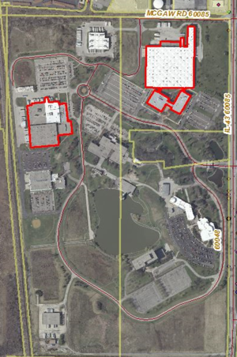

# Industrial Land Uses (1400 Series)
{: .no_toc }

## Table of Contents
{: .no_toc .text-delta }

* TOC
{:toc}
---

## Mineral Extraction (1410)

**Definition:** Includes coal mining; crude petroleum and natural gas
mining; stone, sand, and clay quarrying. Includes active sites, as well
as inactive sites which may contain water but show no attempt at
reclamation or re-use.

**Discussion:**

**Examples:**

**Q&A:**

-   *Q: Some of the parcels that were coded Ag through automation have a
    significant portion which is actually Mineral Extraction. Should
    they be left as Ag or changed?*
    -   **A:** The original automated procedures had a threshold of 25%,
        meaning 25% of the landcover pixels falling in the parcel had to
        have an agricultural classification. Since Mineral Extraction is
        considered a "developed" land use, it carries greater land use
        weight, and would trump the developed land use. For these mixed
        parcels, recode to Mineral Extraction if at least 25% of the
        parcel is covered by this activity (including pits, ponds and
        staging areas).

## General Industrial &lt; 100,000 s.f. RBA (1420)

**Definition:** Includes smaller-scale manufacturing and warehousing
operations. Primary identification criteria is the categorization of
built property as “Industrial” by county assessor, and is not involved
in mineral extraction (1410), larger-scale Industrial uses (series
1430), or storage (1450). Includes dominant 2-digit NAICS code where
available.

**Discussion:** If the property is in an industrial context
(county-classed as IND, and surrounded by other industrial properties),
but a business occupying that space just happens to be more of an “urban
mix” activity but could just as easily be occupied by an industrial-type
business (with examples being an auto repair shop and small-scale
tool-and-die operation, respectively), then the parcel can remain
Industrial. While the Inventory is parcel-based and suggests a very high
level of specificity, we do need to allow for some generalization to
account for the fact that we will:

-   never get everything exactly right, and…
-   …even if we did, it will only be right as long as that auto-repair
    shop stays at that location.

The concern has to do with how we will update this in the future.
Whereas in this 2010 version a high percentage of parcels were coded via
manual review, updates will hopefully be done in a more automated
fashion, involving doing a comparison of a new parcel file to what the
county provided us in 2010. For updates, the plan is that indicators of
land use change would include:

-   New PIN numbers or changes in parcel geometry
-   a change in the county’s classification of the parcel (say, from IND
    to COM),
-   or a radical change in the property value relative to surrounding
    properties.

In this kind of situation we would miss the proverbial change from Urban
Mix to Industrial General if the building tenant changes. For the
purposes of regional planning and analysis, I think it’d be better that
we were correct in the general sense (Industrial) than to be “right” at
this given point in time.

That said, the context has to be seriously considered. Will County had
many parcels classed by the Assessor as “commercial” which were
structurally and functionally industrial properties; in those cases the
coders were instructed to ignore the Assessor and assign the appropriate
Industrial code.

**Examples:**

**Q&A:**

-   *Q: How does a publishing company get coded?*
    -   **A:** If the building actually has production of published
        materials going on and it is under 100,000 sq ft, then code it
        as **1420 General Industrial**. You can probably tell this by
        seeing that it has docks for loading published materials and has
        a fairly large parking lot for employees involved in the
        publishing. Also much of the building will have a flat roof and
        few windows. If there are many docks, but a very small parking
        lot, then this may just be a warehouse. If the building appears
        to have many offices and no docks, then it’s probably an office
        building for the publishing company and no actual publishing is
        going on at that site.

-   *Q: How does a research & development company get coded?*
    -   **A:** If the building is less than 100k sq ft and the county
        has coded the property Industrial, then code this **1420**. If
        the building is greater than 100k sq ft and coded Industrial by
        the county, then follow the guidelines for that size of a
        building which will be to code it **1433**.

-   *Q: How do I code the parcel pictured below? It is owned by
    University of Chicago and the county classifies it as Exempt. 2005
    Land Use coded it as Industrial General. It is located much farther
    south than the main U of C campus and research shows it to be
    University of Chicago Press.*
    -   **A:** This would be coded **1420 Industrial General** once
        again in 2010. Even though it is Exempt by the county and is
        owned by University of Chicago, it is not a property where
        students and professors converge. They print books here.

        
        

-   *Q: Below is an image of a privately owned small business that is a
    recyling and waste services company. The county use code is 517
    Commercial One-story store which does not seem to fit what I can see
    on this parcel. How should I code this?*
    -   **A:** If we did know that there was some sort of retail
        activity going on here, we might code is Urban Mix, but it looks
        much for industrial. If the overall primary activity is just
        trucks and bins as can be seen in the photo, then code it **1420
        General Industrial**. If you did determine that there was actual
        sorting/processing of recyclables happening on this property,
        then it could be coded **1564 Other Utility/Waste**.

        

## Industrial Properties Greater Than 100,000 s.f. RBA (1430 Series)

This category includes industrial properties where total building size
is 100,000 square feet or larger. Building size figures rely on Co-Star
database, where available; use assignment based on Dun & Bradstreet
company data and visual interpretation of imagery. Includes dominant
2-digit NAICS code where available. **Company on more than one parcel:**
In many cases, a large industrial building may be located in more than
one adjacent parcels and all with the same owner. Occasionally, there
will be more than one building on these parcels. If the combined size of
all buildings on adjacent industrial parcels with the same owner is
greater than 100,000 sq ft, then you can consider that the property has
met the 100,000 sq. ft. rule.

This is also true for refineries or oil/chemical storage tank
facilities. On these properties you do not typically see large buildings
but rather large areas of impervious surface with many large tanks and
other equipment. Measure all the impervious area that has tanks or other
equipment on it which may be located on one parcel or more adjacent
parcels with the same owner. If that area is 10 acres or larger, then
consider it to be large industrial and code the parcels either **1431
Manufacturing** or **1432 Warehousing/Distribution** depending on which
activity predominates on those parcels.

**NOTE:** Especially with more modern industrial buildings, it’s really
difficult to tell from the air whether or not a building’s purpose is
primarily manufacturing or warehousing. In many cases these buildings
were built on spec to accommodate either activity. Because of this,
consider **the default code** for such properties to be **1433
(Flex/Indeterminate)**, and only assign the **1431 Manufacturing** or
**1432 Warehousing** codes when there is strong evidence that the
property can support one activity to the exclusion of the other. Also,
if a parcel is coded industrial by the county, the building is greater
than 100,00 s.f., and the company appears to be involved in **research
and development activities** at this site, code this **1433** since we
have not specifically addressed this business activity in the
classification scheme.

A note about the NAICS codes: they describe what industry the company is
involved in, but not necessarily the activity at the site. A company
that is primarily involved in manufacturing might primarily or only have
warehouse/distribution space at a particular location.

### Manufacturing/Processing (1431)

**Definition:** Properties where the manufacturing of goods is the sole
on-site activity.

**Discussion:**

**Examples:**

**Q&A:**

-   *Q: The photo below shows a large fiberglass manufacturing company
    with their manufacturing facility on W 59th St and then 2 additional
    parcels along the Sanitary & Ship Canal which were coded as Other
    Linear in 2005. How should I code these parcels along the canal?*
    -   **A:** Even though these two parcels along the canal are owned
        by the manufacturing company, it appears that location is
        involved in the transfer of goods to/from the factory. Therefore
        looking at those 2 parcels from a functional standpoint, they
        would once again be coded **1520 Other Linear Transportation**
        even though they are owned by the manufacturing company. If the
        parcels were adjacent to the large manufacturing complex, then
        it could be appropriate to include them in the manufacturing
        code, but in this case, they are not.

        

-   *Q: How do I code the large refinery in the photo below?*
    -   **A:** In this case, there is no large building to measure to
        meet the 100,000 sq ft rule. Measure the impervious area which
        contains tanks and refinery processing equipment. If that area
        is 10 acres or larger, then code it **1431 Manufacturing** since
        a refinery processes oil into other products.

        

### Warehousing/Distribution (1432)

**Definition:** Primary activity on the parcel is the storage and
distribution of goods. Does not include commercial storage (see 1450).

**Discussion:** These properties are commonly identified by:

-   Copious amounts of truck access;
-   Flat roof, with little evidence of a heavy power draw;
-   Not much car parking (these operations require relatively few
    employees.

**Examples:**

Exel North American Logistics, Inc. Note small parking lot
for employees relative to building size. Building is over 250,000 sq.
ft.

**Q&A:**

### Flex or Indeterminate (1433)

**Definition:** Industrial properties where there is no clear use, or is
a mix of office space with manufacturing and/or warehousing.

**Discussion:** In new industrial areas, you may find 100,000+ sq ft
buildings that are not yet occupied which have been "built on spec"
meaning they were built on speculation without having tenants yet
identified. These large industrial buildings are such that they can be
used for manufacturing, warehousing, or distribution depending on the
needs of the company that occupies the space. In more established
industrial parks, you may find such a building that is currently vacant.
These buildings are good examples of when to code a parcel as **1433
Industrial Flex/Indeterminate**.

**Examples:**

**Large corporate campus.** In the photo below is what in
2010 was the large corporate campus for Cardinal Health (formerly
Allegiance Healthcare). In several large parcels are a mix of office
space and of manufacturing/shipping on the same property. Because of the
size and the mix of "brains" (office) and "brawn"
(manufacturing/shipping) in the same parcels, code this as **1433**.

Another example of a large industrial complex which would be coded
**1433** is Cinespace Chicago Film Studios on Chicago's near southwest
side on the site of the former Ryerson Steel Company. While this studio
complex is in the entertainment industry, people don't actually go there
to be entertained, rather movies and television shows are filmed there
so code it **1433** because of campus size and variety of activities on
properties.

A third example of a large corporate campus, and which also includes the
world headquarters, is Abbott Laboratories in Lake County. While the
campus includes large office buildings for the world headquarters, it
also has manufacturing and distribution on the campus, so code the
entire campus **1433**.

**Large indeterminate building.** In the photo below is a building over
100,000 sq ft owned by McKesson Corporation which internet research
shows is involved in many different ventures. It is not clear what is
going on at this particular location. The county has coded the property
Industrial. While it does appear there is distribution activity, there
is also a great deal of parking spaces which would suggest manufacturing
and/or office space. Because the county codes it as industrial, the
building is over 100k sq ft, and the activity is unclear, code such a
parcel **1433**.

**Q&A:**

-   *Q: How do I code the building shown below. Lake County classifies
    it as Commercial. it is technology services, also called at
    "data-hosing" building for HSBC, a large financial institution. The
    building is greater than 100,000 Sq Ft. It has a small parking lot
    and a huge fence surrounding the building.*
    -   **A:** Even though the county codes this as Commercial, our code
        of **1433 Industrial Flex/Indeterminate** really is the most
        appropriate code for this parcel.

        

-   *Q: How do I code the building shown below? Will County classifies
    half of the building as Commercial and half as Industrial. The
    building is a laboratory for testing food products, but does have a
    significant amount of parking. The building is less than 100,000 SF,
    but if it were larger than 100,000 SF, what would it be coded as?*
    -   **A:** While this particular building should be coded as
        **General Industrial &lt; 100,000 s.f. RBA (1420)** because it
        is less than 100,000 SF, if it were larger than 100,000 SF it
        would be coded as **1433 Industrial Flex/Indeterminate**. While
        very small things are possibly manufactured here, its use fits
        more in the Industrial Flex/Indeterminate category. Despite
        there being a significant number of people who work at this
        laboratory, the building functions more as an industrial than an
        office commercial use.

        

## Storage (1450)

**Definition:** Long-term storage facilities including:
commercial(public) storage, yacht/boat storage, and auto junkyards; in
other words, where things go to sit and do nothing.

**Discussion:** Commercial storage is often called "self-storage" where
individuals or small companies rent space to store their goods.

Many junk yards or salvage yards for autos and/or trucks also can be
businesses where used parts are sold to the public. We will still code
these as **Storage 1450**.

**Examples:**

**Q&A:**

-   *Q: How should a company that moves and stores goods for people or
    businesses be coded?*
    -   **A:** Code this as **Warehousing/Distribution 1432**. This
        would include professional moving companies that also store
        people's goods and it would include a place like Iron Mountain
        that stores papers for companies.

-   *Q: How should a large facility that is a place where small
    businesses can store their own goods be coded?*
    -   **A:** Code this as **Storage 1450**. This would be considered
        public storage even though the customer storing the property is
        a small business.
