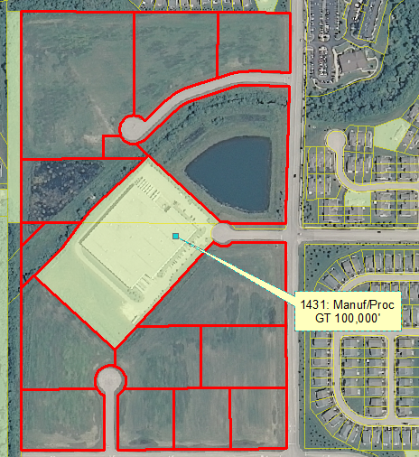

# Vacant or Under Construction (4000 Series)
{: .no_toc }

## Table of Contents
{: .no_toc .text-delta }

* TOC
{:toc}
---

## Vacant/Undeveloped Land (4100 Series)

**Definition:** Land in an undeveloped state, with no agricultural
activities nor protection as open space. When land is identified in
Assessor data as being Residential, Commercial or Industrial land, it is
coded to the corresponding vacant land use (below). Includes razed
properties in urban settings.

This does not usually include vacant developed properties where
buildings and infrastructure are still intact. In this case, code them
to the use they had prior to being vacant or their likely next use, if
you know that. Also use the Assessor county code to be your guide. One
exception to this is when a building has NO roof on it anymore or it has
been vacant for MANY years or even decades and you have learned that
shortly after 2010 the building was actually torn down. In this case,
you may code it as the appropriate vacant code even though it
technically was still standing in spring 2010.

This thinking about when to code a parcel as vacant also holds true for
shopping centers. While a shopping center may have anchor stores gone,
often it still has some tenants. As long as the building structures are
still intact, and despite many vacant spaces, still code it for the
intended use, unless the guidelines in the statement above apply such as
NO roof, vacant for decades, and you have evidence it was torn down
shortly after 2010, so it would be coded vacant.

### Vacant Residential Land (4110)

**Definition:** Undeveloped land classified as “Residential” by county
assessor. Includes undeveloped parcels in mature subdivisions (when not
owned by an adjacent landowner), as well as undeveloped parcels in newer
subdivisions where general construction activities have been completed
(and are not owned by an adjacent landowner).

**Discussion:**

**Examples:**

**Q&A:**

-   *Q: I have seen a number of parcels in residential areas that only
    have a garage on them or perhaps an old barn. I know that if an
    adjacent residential parcel has the same owner, then to code these
    with the same land use as the adjacent parcel and being sure to have
    zero housing units on this parcel. How do I code such a parcel if no
    adjacent parcel has the same owner?*
    -   **A:** If a parcel has been coded by the county as residential;
        it only has a garage or large barn on it; and no adjacent parcel
        has the same owner, then code it vacant residential. This would
        also be the case if the parcel only had rusting junk, shipping
        containers, old cars or boats, etc. on it and there is no
        evidence of any commercial or industrial activity such as a Dun
        & Bradstreet point for a business.

-   *Q: There are several parcels in residential areas in Markham that
    have nothing on them. The Taxname is "Moss Sewer Water". The
    Contours layer shows that these are NOT retention/detention basins.
    These parcels do NOT have an adjacent parcel that has a residence on
    it with the same owner. Some of the parcels have a county use code
    of 241 Vacant: Vacant land under common ownership with adjacent
    residence. This is confusing because NONE of these parcels have an
    adjacent parcel with that same owner of Moss Sewer Water. How do I
    code these?*
    -   **A:** Code these as **4110 Vacant Residential**. We have found
        that frequently assessor data in south Cook County did not
        reflect reality so a common owner for an adjacent residential
        parcel may have been the case in the past, but no longer true.

### Vacant Commercial Land (4120)

**Definition:** Undeveloped land classified as “Commercial” by county
assessor.

**Discussion:** It is more obvious that land is vacant when there is no
building on it or only remains of a demolished building. Classification
can be more difficult if buildings are still standing on the property.
The general rule is that if you learn that a large property still
standing was vacant in spring of 2010 and **there is no hope of
rehabilitation for the same use,** then code the parcels as Vacant
Commercial. This category also includes small parcels that only contain
a billboard. Billboards are not considered permanent structures, so if
the parcel was bought it would be taken down.

**Examples:**

-   **Example 1: Former Fairgrounds.** The former fairgrounds
    in Grayslake in the photo below is an example of **there is no hope of
    rehabilitation for the same use** since Internet research reveals a new
    location for the current Lake County Fair and our NDD reference layer
    shows a proposed 800,000 sq ft retail operation planned for the site.
    **4120 Vacant Commercial** is appropriate for these parcels since the
    county classes the them as Commercial.

    

-   **Example 2: Former Rockenbach Chevrolet Dealership buildings.** The
    photo below shows the buildings formerly used by the Rockenbach Chevy
    dealer. The new dealership is a now a few blocks away. This vacant
    property is in **move-in ready** condition so it should be coded **1215
    Urban Mix**.

    

**Q&A:**

-   *Q: How do I code a theater that I know was vacant in 2010, but the
    building is still standing and a preservation organization is
    seeking funding to retore this theater?*
    -   **A:** Code this as **1240 Cultural/Entertainment**. The general
        rule is that if vacant buildings are still basically functional
        and therefore could be used for their intended function, then
        code them with that functional code. So a vacant store building
        would be coded with one of the retail codes and a vacant theater
        with the 1240 code.

-   *Q: I encounter many situations in which one parcel identified as
    commercial by the county has a particular owner and a building on
    it. Then another parcel next to this parcel and with the same owner,
    has absolutely nothing on it. I can see no way that the owner of
    this parcel is using the second parcel in conjunction with the use
    on the first parcel. How do I code this second parcel?*
    -   **A:** If this second parcel truly appears to be vacant and it
        is big enough to have some sort of significant business activity
        on it, then code is as vacant. If the parcel is quite small such
        that no real business activity could occur on it, then code it
        the same as the first parcel as though it was part of that
        business land use.

-   *Q: How do I code the parcel in the photo below. It is coded as
    Vacant Land by the county. The tax owner does not match any of the
    adjacent parcels. About 30% of the parcel's active use is the
    retention pond. The other use is passive in that it is vacant.
    Should this be treated with the 25% rule applied on Ag parcels so it
    would be Stormwater, 1565 or should the dominant land area be used
    for the code so it would be Vacant Commercial?*

    

    -   **A:** In this case the code to use is **4120 Vacant
        Commercial** even though the non-pond area is "passive", it has
        high potential to become an active use since it is situated in
        the middle of all commercial activity.

### Vacant Industrial Land (4130)

**Definition:** Undeveloped land classified as “Industrial” by county
assessor.

**Discussion:** It is more obvious that land is vacant when there is no
building on it or only remains of a demolished building. Classification
can be more difficult if industrial buildings are still standing on the
property. The general rule is that if you learn that a large property
still standing was vacant in spring of 2010 and **there is no hope of
rehabilitation for the same use,** then code the parcels as Vacant
Industrial. On the other hand, if the vacant industrial buildings appear
to be able to be re-used, then code as the original industrial land use.

**Examples:**

**Q&A:**

### Other Vacant (4140)

**Definition:** Undeveloped land classified as "Vacant" or “Agriculture”
by county assessor (where less than 25% of the parcel is farmed); or
where classification is unknown and there is no evidence of a developed
activity or an association with adjacent developed parcels.

**Discussion:** "Other Vacant" serves as a catch-all for vacant land
(with little or no ag activities) where a planned/potential use is not
stated in the Assessor data. Most counties have a "vacant" category,
although it seems to be inconsistently applied. If a parcel is listed by
the Assessor as "vacant," but is in the middle of a lake, it should be
coded Water (5000). If there is evidence of ag activities taking part on
more than 25% of the parcel, it should be coded Agriculture (2000).

**Examples:**

The parcels outlined in red are **probably** subdivided as
part of an industrial development, as evidenced by the Manufacturing
parcel in the middle of it. However, the Kane Assessor has these
properties listed as "Vacant," and not "Industrial." Although your gut
tells you to code this as Vacant Industrial, stick with the guidelines
and code this 4140 Other Vacant.

**Q&A:**

-   *Q: How do I code various sizes and shapes of parcels owned by the
    State of IL or by a county that have nothing developed on them and
    are typically among parcels which are commercial, industrial, or
    residential?*
    -   **A:** Code these as 4140 Other Vacant. Even though being coded
        as vacant often means that a parcel has development potential
        and governments are not usually in the business of land
        development, someone using the data will be able to use the
        government ownership in the parcel layer or use other data
        layers to determine that these parcels, though coded as vacant,
        do not have development potential.

-   *Q: How do I code a series of parcels owned by IDOT that appear to
    form what will be a future expressway? Some parcels appear to be
    vacant and others currently have crops on them.*
    -   **A:** Code the vacant parcels **4140 Other Vacant** and code
        the ones with at least 25% agricultural activity as **2000
        Agriculture** and put a **O** for **Other** in the Platted
        Modifier field for the Ag ones.

-   *Q: How do I code a parcel that in 2010 is being used for nearby
    road construction materials and equipment? The county code is VACANT
    Minor Improvement on Vacant Land. LandUse Pass 1 is Unknown/Misc.
    Tax Owner is different from adjoining parcels. It was vacant in 2005
    and after 2010 became a retail building.*
    -   **A:** Since this parcel was coded by the county as Vacant and
        it appears to be temporarily used for a nearby major road
        construction project, we will follow the lead of the county and
        code it **4140 Other Vacant**.

## Under Construction (4200 Series)

Land has been platted for development, and construction activities are
evident in aerial imagery (i.e. roadways begun, scraped earth,
partially-completed structures, missing or incomplete landscaping). With
the exception of Residential properties (see below), each parcel will be
evaluated as vacant/construction/finished on a parcel-by-parcel basis.

In some situations, stalled or abandoned construction may be what you
see in the aerial photography for the land use year in question. You
will often find looking at successive years of aerial photography
helpful to support a determination that construction has stalled or was
abandoned. It may have been active construction one or more years ago,
but from aerial photography, or from other sources, you determine that
construction has stopped. If this is the case, code this as “vacant”
instead of “under construction”. An obvious example of this is aerial
photography that shows a building foundation that is now filled with
water and no evidence from any source of active construction happening.

### Under Construction, Residential (4210)

**Definition:** The “construction” designation is applied at the
individual parcel (as opposed to the whole subdivision) level, where
construction activity (scraped earth, foundations, etc.) are present;
this is done to prevent stalled or “ghost” subdivisions from showing up
as active developments. Finished structures within these subdivisions
will be coded to their finished use.

**Discussion:**

**Examples:**

-   **Example 1: Conflicting Evidence.** You may often find
    conflicting information in the reference layers with a parcel under
    construction since the parcel is in transition. In the photo below, the
    Tax Owner is still Aetna Bearing Company since there had been an
    industrial building on this parcel in the recent past. The parcel is
    mostly vacant and Cook County Assessor says this land is vacant, however
    there are two small buildings in the bottom left of the parcel which
    Google Street View reveals to be 3-flat apartment buildings. The 2010
    aerial photo shows a large dumpster behind these buildings and the
    Zoning reference layer codes this area as Planned Development. We will
    go with the more developed landuse of the apartment buildings over the
    vacant part of the parcel. We will conclude that these buildings are not
    completed yet because of the dumpster and that more will eventually be
    built because of the Zoning Code so the code for this will be **4210
    Under Construction, Residential**.

    

**Q&A:**

-   *Q: What about the common areas of a new development that appear to
    be finished such as retention ponds in place, bushes planted, etc.
    but most of the residential lots do not have houses on them yet?*
    -   **A:** It's ok to code these common areas in a new development
        that are basically finished as **1151 Residential Common**.

-   *Q: How do a code a parcel that previously had a very small house
    on it, but now has a much bigger house which is under construction
    on this parcel?*
    -   **A:** If it is obvious that this bigger house is not just a
        remodel and expansion of the older house, then code it "Under
        Construction".

### Under Construction, Commercial (4220)

**Definition:**

**Discussion:**

**Examples:**

**Q&A:**

### Under Construction, Industrial (4230)

**Definition:**

**Discussion:**

**Examples:**

**Q&A:**

### Under Construction, Other or Unknown (4240)

**Definition:**

**Discussion:**

**Examples:**

**Q&A:**
