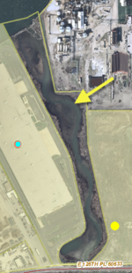

# 5000: Water

**Definition:** Parcel is predominantly water.

**Discussion:** In some lake side areas, you will find HOAs (Home Owner
Associations) that also join together to form "water associations" or
"waterway associations" for neighborhoods to support the lake ecosystem.
Any parcels owned by a homeowner association or a water or waterway
association that is totally water would be coded as **5000 Water**.
"Water association" or "waterway assocation" LAND will be treated
similar to HOA land and coded 1151 Residential Common.

Also, occasionally you will find parcels that are boat slips in a
lake-side residential area and each boat slip has a private owner which
is the same as a nearby townhouse or detached house owner. If these boat
slip parcels are totally water, they too would be coded **5000 Water**.
If such boat slip parcels happened to be owned by a HOA or water
assocation and they were totally water, also code these as **5000
Water**.

**Examples:**

In the photo below, a separate parcel only
contains what appears to be the remnants of a natural stream. Because it
is not an actual detention/retention basin structure, code this **Water
5000**.

**Q&A:**

---

*Return to [A field guide to Land Use Inventory classifications](./index.md)*
