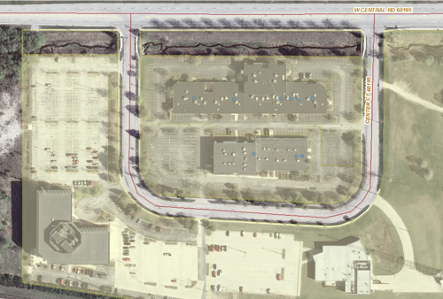
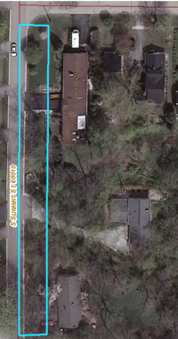
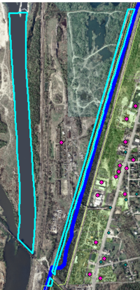

# Not Classifiable (9999)

**Definition:** Sliver or isolated parcel with no identifiable use.

**Discussion:**

**Examples:**

If a parcel ONLY includes a breakwall on Lake Michigan and
nothing else, then code it **9999**.

Another example of uncodeable parcels are those below that contain a
stream. The two parcels next to Central Road have an owner of Alter
Asset Management, which is DIFFERENT from any of the other parcels
nearby. The County codes it as Vacant and the LUPASS1 considered it
Unknown. Coding it as vacant would imply that it could be available for
development which is not the case since there is a stream running
through these parcels. It is not a built retention/detention basin.
Therefore, we will consider it **9999 Not Classifiable**.

**Q&A:**

-   *Q: The photo below shows a parcel that is Exempt and owned by
    Village of Barrington. This parcel includes part of Summit St and
    parts of the driveways and front yards of three residences. How do I
    code this?*
    -   **A:** I'd say that it is a good candidate for **9999**. This
        parcel holds no potential for future development and we have no
        category in the classification scheme that describes it.

        

-   *Q: Below is ONE parcel that is listed as unknown/miscellaneous.
    Part of it is a river; the other part is a railroad. How should this
    be coded?*
    -   **A:** This is a good candidate for **9999**. If the
        rail-to-water ratio was much higher for the railroad, I'd
        suggest Rail ROW, since the railroad would be the more active
        land use, but in this case the rail portion of this one parcel
        is much smaller than the river portion. Let's use **9999**.

        
